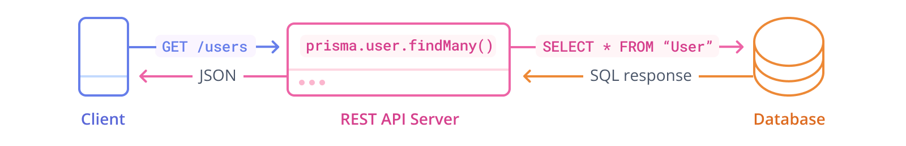

## Comandos para preparar ambiente
* npm install

Las dependencias ya estan configuradas, al agregar nuevas verificar si son dependencias
necesarias para la ejecucion o si son dependencias de desarrollo.

## Comandos PRISMA
* npx prisma init: Inicializar Prisma (ya se ha inicializado).
* npx prisma migrate dev --name init: Migracion a base de datos configurada. (Usa este)
* npx prisma generate: Generar modelo de datos.
* npx prisma studio: Consultar datos.
* npx prisma db: Consultar datos en consola.

## Informacion adicional

* Interfaces en TypeScript: Se utilizan para definir la estructura de los datos a nivel de código. Son útiles para la validación estática y para asegurar que diferentes partes de tu aplicación utilicen datos con la misma forma.
* Modelos (Schemas): Se utilizan para interactuar con la base de datos y pueden estar definidos en herramientas como Prisma. Los modelos son clases u objetos que representan entidades de la base de datos.

## Esquema API REST

Fuente: Prisma ORM Docs
